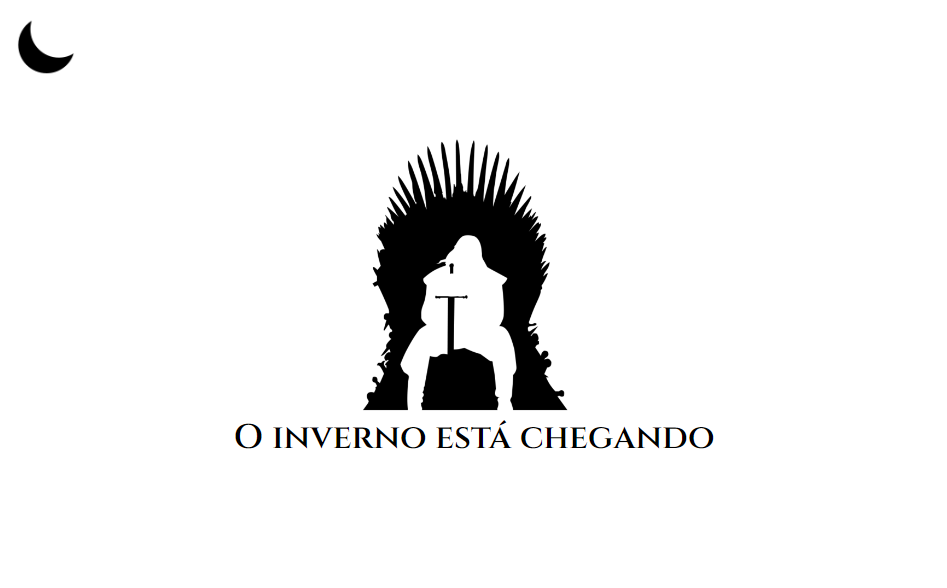
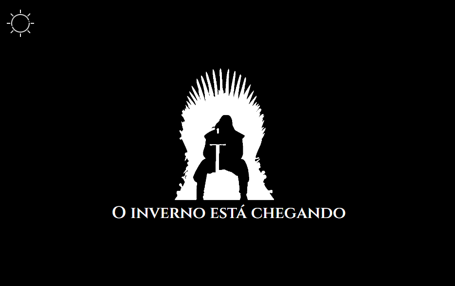

  <h1>
    Dark Mode: um projeto em HTML/CSS
  </h1>

  
  

[Acesse o projeto](https://allesoares95.github.io/DarkMode/)

### Utilização de Dark Mode:

    A funcionalidade Modo Noturno, conhecida também como Dark Mode, 
    está cada vez mais popular, podendo ser encontrada em diversos tipos de 
    aplicações, seja em redes sociais, plataformas educacionais ou de 
    entretenimento.

    Utilizando o click no icons de Lua ou Sol o fundo do projeto sera alterado;
    

